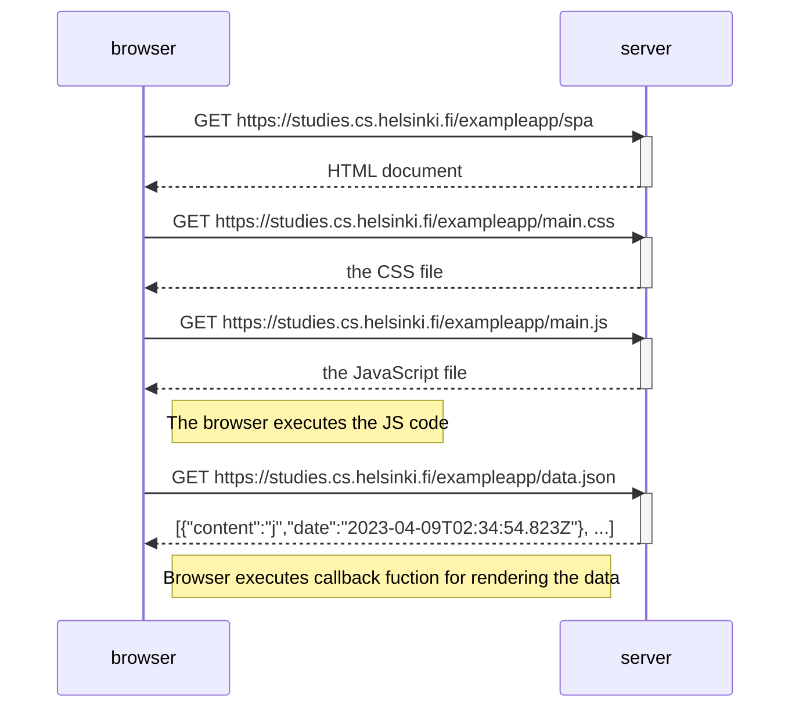

```mermaid
sequenceDiagram
    participant browser
    participant server

    
    browser->>server: GET https://studies.cs.helsinki.fi/exampleapp/spa
    activate server

    server-->>browser: HTML document
    deactivate server

    browser->>server: GET https://studies.cs.helsinki.fi/exampleapp/main.css
    activate server

    server-->>browser: the CSS file
    deactivate server

    browser->>server: GET https://studies.cs.helsinki.fi/exampleapp/main.js
    activate server

    server-->>browser: the JavaScript file
    deactivate server

    Note right of browser: The browser executes the JS code

    browser->>server: GET https://studies.cs.helsinki.fi/exampleapp/data.json
    activate server

    server-->>browser: [{"content":"j","date":"2023-04-09T02:34:54.823Z"}, ...]
    deactivate server

    Note right of browser: Browser executes callback fuction for rendering the data
```