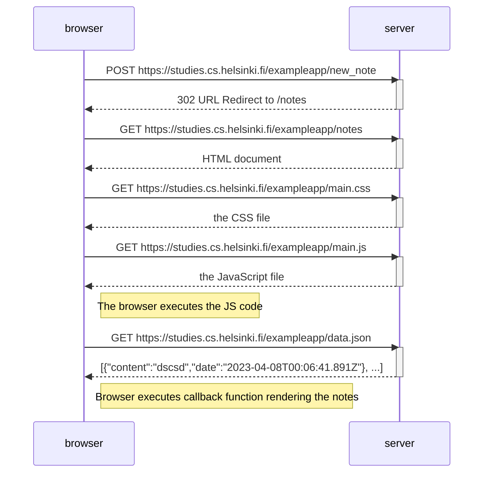

```mermaid
sequenceDiagram
    participant browser
    participant server

    
    browser->>server: POST https://studies.cs.helsinki.fi/exampleapp/new_note
    activate server

    server-->>browser: 302 URL Redirect to /notes
    deactivate server

    browser->>server: GET https://studies.cs.helsinki.fi/exampleapp/notes
    activate server

    server-->>browser: HTML document
    deactivate server

    browser->>server: GET https://studies.cs.helsinki.fi/exampleapp/main.css
    activate server

    server-->>browser: the CSS file
    deactivate server

    browser->>server: GET https://studies.cs.helsinki.fi/exampleapp/main.js
    activate server

    server-->>browser: the JavaScript file
    deactivate server

    Note right of browser: The browser executes the JS code

    browser->>server: GET https://studies.cs.helsinki.fi/exampleapp/data.json
    activate server

    server-->>browser: [{"content":"dscsd","date":"2023-04-08T00:06:41.891Z"}, ...]

    deactivate server

    Note right of browser: Browser executes callback function rendering the notes
```